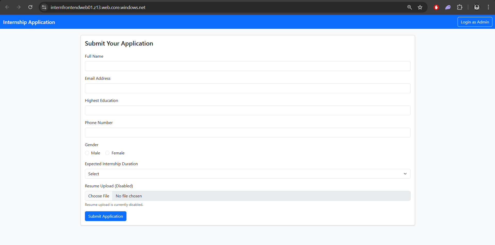
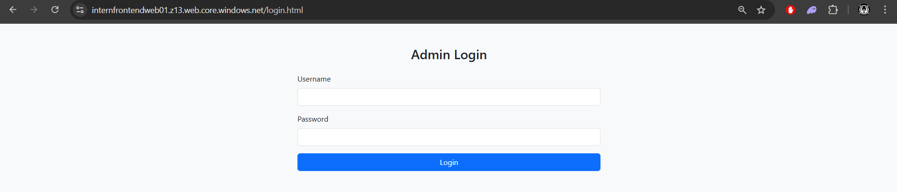
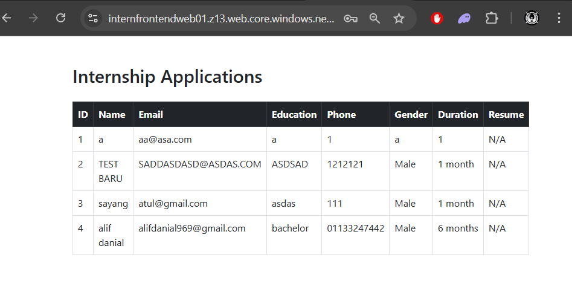
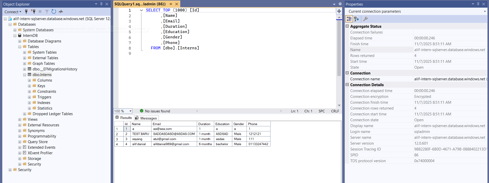

# 🧑‍💻 Internship Application Portal

A internship applications built with **ASP.NET Core Web API**, **SQL Server**, and a **static HTML frontend** hosted on Azure.

## 🚀 Live Demo

- 🌐 Frontend: [internfrontendweb01.z13.web.core.windows.net](https://internfrontendweb01.z13.web.core.windows.net)
- 🔗 Backend API: [intern-api-alif.azurewebsites.net/api/Interns](https://intern-api-alif.azurewebsites.net/api/Interns)

---

## 📌 Features

✅ Submit internship applications via a simple HTML form  
✅ Admin page to view submitted applications  
✅ SQL Server database integration  
✅ Deployed to Azure using GitHub Actions (CI/CD)  
✅ CORS configured for secure frontend-backend communication  

---

## 🛠️ Tech Stack

| Layer       | Technology                        |
|------------|------------------------------------|
| Frontend    | HTML5, Bootstrap 5, JavaScript     |
| Backend     | ASP.NET Core Web API (C#)          |
| Database    | Azure SQL Database (via EF Core)   |
| Deployment  | Azure App Service + Static Web App |
| CI/CD       | GitHub Actions                     |

---

## 📸 Screenshots

### 📝 Submit Internship Application Form  

### 🔐 Admin Login Page  

### 📋 Admin Application Dashboard  

### 🗄️ Data Stored in SQL Server  

## 🧠 Learning Highlights

- Azure Web App & Static Site Hosting
- ASP.NET Core Web API CRUD operations
- SQL Server DB with Entity Framework Core
- GitHub Actions for automated deployment
- CORS configuration between frontend & backend

📧 Contact
👤 Name: Alif Danial
💼 LinkedIn: linkedin.com/in/alifdanial969
📫 Email: alifdanial969@gmail.com

